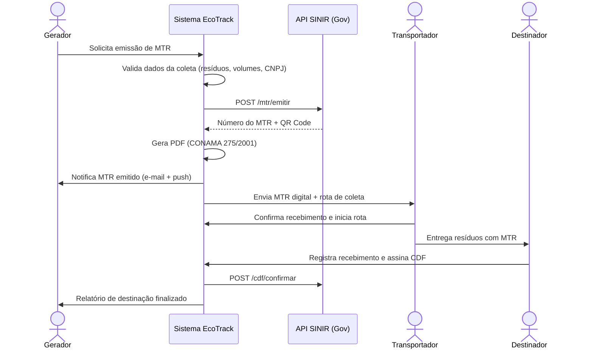
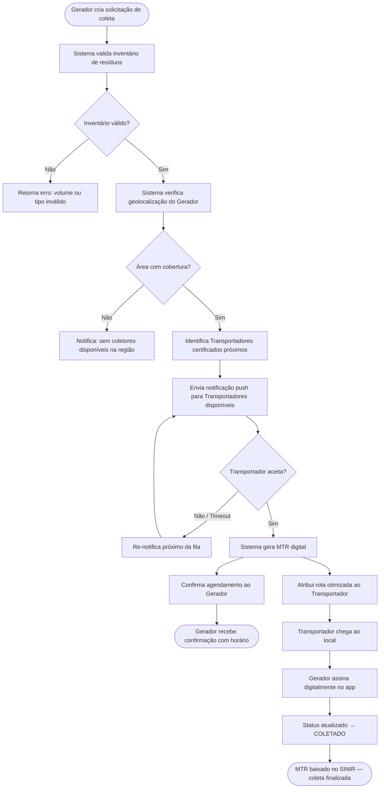

# Especificação Técnica: Plataforma SaaS de Gestão de Resíduos para Pequenos Geradores

Este documento detalha a arquitetura, funcionalidades e o fluxo de desenvolvimento de uma plataforma SaaS (Software as a Service) voltada para restaurantes, clínicas e pequenas indústrias. O objetivo principal é facilitar a conformidade com a **Política Nacional de Resíduos Sólidos (PNRS)** e automatizar a emissão de **Manifestos de Transporte de Resíduos (MTR)**.

---

## 1. Visão Geral do Sistema

A plataforma atua como um ecossistema de conexão entre três pilares fundamentais da cadeia de resíduos, oferecendo ferramentas específicas para cada perfil de usuário:

| Perfil | Papel no Sistema | Principais Necessidades |
| :--- | :--- | :--- |
| **Gerador** (Restaurantes, Clínicas) | Origem do resíduo | Conformidade legal, relatórios de sustentabilidade, facilidade no descarte. |
| **Transportador** | Logística de coleta | Otimização de rotas, gestão de frota, documentação digital (MTR). |
| **Destinador** (Aterros, Recicladoras) | Recebimento final | Controle de entrada, emissão de Certificado de Destinação Final (CDF). |

---

## 2. Funcionalidades Principais

### 2.1. Módulo do Gerador (Foco em Simplicidade)

#### Inventário Digital de Resíduos

- **RF1.1.1:** Permitir o cadastro de diferentes tipos de resíduos gerados pelo usuário (ex: orgânicos, recicláveis, infectantes, químicos).
- **RF1.1.2:** Sugerir tipos de resíduos com base na classificação da ABNT NBR 10.004 e na lista oficial do IBAMA, facilitando a categorização.
- **RF1.1.3:** Permitir a especificação da quantidade gerada (peso em kg ou volume em litros) e a frequência de geração (diária, semanal, mensal).
- **RF1.1.4:** Validar se o tipo de resíduo selecionado é compatível com a atividade principal do gerador (ex: restaurante não pode gerar resíduo hospitalar de alta periculosidade).
- **RF1.1.5:** Manter um histórico do inventário de resíduos, permitindo consultas e auditorias.

#### Agendamento de Coletas

- **RF1.2.1:** Exibir uma interface de calendário intuitiva com datas e horários disponíveis para agendamento de coletas.
- **RF1.2.2:** Permitir a seleção de um ou mais tipos de resíduos específicos do inventário para a coleta agendada.
- **RF1.2.3:** Enviar notificação automática (e-mail/push) ao transportador homologado sobre a nova solicitação de coleta.
- **RF1.2.4:** Permitir o cancelamento ou reagendamento da coleta pelo gerador dentro de um prazo pré-definido (ex: até 24 horas antes).
- **RF1.2.5:** Registrar o status da coleta (pendente, agendada, em rota, coletada, cancelada).

#### Automação de MTR

- **RF1.3.1:** Gerar automaticamente o Manifesto de Transporte de Resíduos (MTR) com base nos dados da coleta agendada, do inventário de resíduos e das informações do transportador.
- **RF1.3.2:** Integrar com a API do SINIR para envio, validação e registro do MTR em tempo real, garantindo a conformidade legal.
- **RF1.3.3:** Permitir a visualização e o download do MTR em formato PDF diretamente da plataforma.
- **RF1.3.4:** Notificar o gerador sobre o status do MTR (emitido, aceito pelo transportador, finalizado pelo destinador, pendente de correção).
- **RF1.3.5:** Armazenar todos os MTRs gerados e recebidos para consulta futura e auditoria.

#### Dashboard de Sustentabilidade

- **RF1.4.1:** Exibir gráficos e métricas claras sobre a quantidade total de resíduos gerados, coletados e destinados por tipo e período.
- **RF1.4.2:** Calcular e apresentar indicadores de impacto ambiental, como "X kg de resíduos desviados de aterros", "Y kg de CO2 evitados" ou "Z litros de água economizados" (com base em fatores de conversão pré-definidos).
- **RF1.4.3:** Gerar relatórios periódicos (mensais, trimestrais, anuais) em formato PDF ou CSV, personalizáveis com o logo do gerador, para fins de marketing verde e compliance.
- **RF1.4.4:** Permitir a comparação de desempenho de sustentabilidade ao longo do tempo.

---

### 2.2. Módulo do Transportador (Foco em Logística)

#### Gestão de Rotas

- **RF2.1.1:** Implementar um algoritmo de otimização de rotas que considere a localização dos geradores, tipos de resíduos, volumes e prazos de coleta.
- **RF2.1.2:** Permitir a visualização das rotas otimizadas em um mapa interativo (integração com Google Maps API).
- **RF2.1.3:** Possibilitar a atribuição de rotas a motoristas específicos e veículos da frota.
- **RF2.1.4:** Fornecer informações em tempo real sobre o progresso das coletas em cada rota.
- **RF2.1.5:** Gerar relatórios de eficiência de rota (distância percorrida, tempo gasto, volume coletado).

#### App de Campo

- **RF2.2.1:** Desenvolver um aplicativo móvel (Android/iOS) para os motoristas com interface intuitiva.
- **RF2.2.2:** Exibir a lista de coletas atribuídas ao motorista para o dia, com detalhes do gerador e do resíduo.
- **RF2.2.3:** Permitir o registro do peso real do resíduo coletado no local.
- **RF2.2.4:** Possibilitar a captura de fotos do resíduo coletado como evidência.
- **RF2.2.5:** Coletar a assinatura digital do gerador na tela do dispositivo móvel para confirmação da coleta.
- **RF2.2.6:** Funcionalidade offline para registro de coletas em áreas sem conectividade, com sincronização automática ao restabelecer a conexão.
- **RF2.2.7:** Navegação integrada com aplicativos de GPS (ex: Waze, Google Maps) para cada ponto de coleta.

#### Checklist de Conformidade

- **RF2.3.1:** Apresentar um checklist digital para o motorista verificar as condições do veículo antes de iniciar a rota (ex: pneus, freios, equipamentos de segurança).
- **RF2.3.2:** Permitir o upload e a gestão de licenças ambientais e documentos do veículo (ex: ANTT, licença de operação) com alertas de vencimento.
- **RF2.3.3:** Registrar não conformidades e incidentes durante a coleta ou transporte, com possibilidade de anexar fotos e descrições.
- **RF2.3.4:** Gerar relatórios de conformidade da frota e dos motoristas.

---

### 2.3. Módulo do Destinador (Foco em Compliance)

#### Recebimento via QR Code

- **RF3.1.1:** Permitir a leitura de QR Codes presentes no MTR digital (impresso ou no aplicativo do transportador) para identificação rápida do resíduo e do gerador.
- **RF3.1.2:** Exibir automaticamente os detalhes do MTR (tipo de resíduo, quantidade, gerador, transportador) após a leitura do QR Code.
- **RF3.1.3:** Possibilitar a validação e confirmação do recebimento do resíduo pelo destinador na plataforma.
- **RF3.1.4:** Registrar a data e hora exatas do recebimento, bem como o responsável pela conferência.

#### Emissão de CDF

- **RF3.2.1:** Gerar automaticamente o Certificado de Destinação Final (CDF) após a confirmação do recebimento e processamento do resíduo.
- **RF3.2.2:** Incluir no CDF todas as informações relevantes do MTR, dados do destinador e detalhes do processo de destinação (ex: tipo de tratamento, data).
- **RF3.2.3:** Permitir a visualização e o download do CDF em formato PDF, com assinatura digital do destinador.
- **RF3.2.4:** Enviar o CDF automaticamente para o gerador e o transportador via plataforma e e-mail.
- **RF3.2.5:** Manter um repositório de todos os CDFs emitidos para consulta e auditoria.

---

### 2.4. Diagrama de Fluxo de Dados (DFD) — Automação de MTR

O diagrama a seguir ilustra o fluxo de dados para a funcionalidade de automação do Manifesto de Transporte de Resíduos (MTR), destacando a interação entre os diferentes atores e sistemas.

---

### 2.5. Diagrama de Fluxo de Dados (DFD) — Conexão Gerador-Transportador

O diagrama a seguir ilustra o fluxo de matchmaking entre o Gerador (solicitante) e o Transportador homologado, desde a criação da solicitação de coleta até o fechamento do manifesto.

---

## 3. Arquitetura do Sistema e Tecnologias

Para um SaaS escalável e de rápida iteração, recomenda-se a seguinte stack:

### 3.1. Frontend e Mobile

- **Web (Admin/Gerador):** Next.js 14 (App Router) com TypeScript e Tailwind CSS para uma interface responsiva e limpa.
- **Mobile (Transportador):** React Native ou Flutter (para rodar em Android/iOS de baixo custo dos motoristas).

### 3.2. Backend e Infraestrutura

- **Linguagem:** Node.js 20 (TypeScript) com Fastify pela agilidade em integrações.
- **Banco de Dados:** PostgreSQL (dados relacionais) + Redis (cache de rotas, sessões e filas via BullMQ).
- **Infraestrutura:** Vercel (frontend), Railway (backend); funções Serverless para processamento de relatórios.

### 3.3. Integrações Críticas

- **API SINIR/MTR:** Integração via Web Service (SOAP/REST) para envio de dados em tempo real ao governo federal.
- **Google Maps / Mapbox API:** Para geocodificação de endereços e otimização de rotas de coleta.
- **Gateways de Pagamento:** Stripe ou Iugu para gestão de assinaturas recorrentes do SaaS.

---

## 4. Fluxo de Funcionamento (User Journey)

1. **Onboarding:** O restaurante se cadastra, informa seu CNPJ e o sistema busca automaticamente os dados no SINIR.
2. **Solicitação:** O gerente do restaurante clica em "Solicitar Coleta de Óleo Usado".
3. **Matchmaking:** O sistema notifica os transportadores homologados na região que aceitam esse tipo de resíduo.
4. **Emissão:** Ao aceitar a corrida, o sistema gera o **MTR Digital** com os dados de ambas as partes.
5. **Coleta:** O motorista chega, pesa o resíduo, tira uma foto e o gerente assina na tela do celular.
6. **Destinação:** O resíduo chega à usina de biodiesel, que confirma o recebimento no sistema.
7. **Fechamento:** O MTR é baixado automaticamente no SINIR e o restaurante recebe o relatório mensal de conformidade.

---

## 5. Roteiro de Desenvolvimento (Roadmap)

### Fase 1: MVP (Produto Mínimo Viável)

- Cadastro de usuários e resíduos.
- Emissão manual de MTR via sistema (sem integração automática total).
- Diretório de transportadores parceiros.

### Fase 2: Automação e Integração

- Integração completa com a API do SINIR para emissão automática.
- App para motoristas (Transportador).
- Gestão de pagamentos e assinaturas.

### Fase 3: Inteligência e Expansão

- Otimização de rotas por IA.
- Módulo de consultoria para elaboração de PGRS (Plano de Gerenciamento de Resíduos Sólidos) automatizado.
- Marketplace de resíduos (venda de recicláveis).

---

## 6. Considerações de Segurança e Compliance

- **LGPD:** Criptografia de dados sensíveis de empresas e usuários; log de acesso a dados pessoais; endpoint de exclusão de conta.
- **Auditoria:** Log de todas as movimentações de resíduos para fins de fiscalização ambiental.
- **Disponibilidade:** O sistema deve prever um "modo offline" para o transportador, sincronizando o MTR assim que houver sinal de internet.
- **Multi-tenancy:** Todas as queries filtram por `empresaId` extraído do JWT para isolamento de dados entre empresas.
